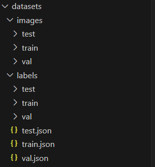
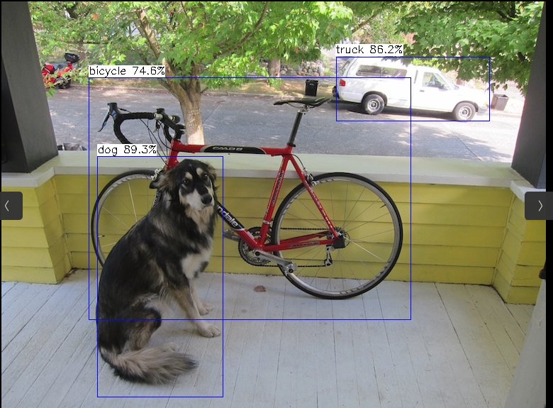
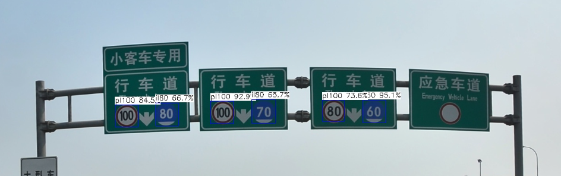

# tengine-lite-yolov5s-tt100k


### 一、训练准备

1、yolov5 tag: v6.1

```sh
git clone https://github.com/ultralytics/yolov5.git
git checkout v6.1
```

2、数据集处理

参考帖子：

[YOLO5用于交通标志牌（TT100K数据集）的训练预测（包含数据集格式的转换——TT100K-CoCo格式-YOLO格式，数据集比例的重新划分以及对应图片集的重新划分）_我宿孤栈的博客-CSDN博客](https://blog.csdn.net/qq_37346140/article/details/127122818?spm=1001.2014.3001.5501)

tt100k数据集  下载地址：[TT100K](http://cg.cs.tsinghua.edu.cn/traffic-sign/data_model_code/data.zip)

使用[脚本](./tools/data_preprocess.py)转换后得到数据集



```
python .\train.py --weights .\yolov5s.pt --cfg .\models\yolov5s.yaml --data .\datasets\tt100k\tt100k_fuxian.yaml --batch-size 8 --name tt100k --epocchs 10
```


```
Validating runs/train/tt100k/weights/best.pt...
Fusing layers... 
Model Summary: 213 layers, 7131490 parameters, 0 gradients, 16.1 GFLOPs
               Class     Images     Labels          P          R     mAP@.5 mAP@.5:.95: 100%|██████████| 244/244 [00:17<00:00, 14.18it/s]                       
                 all       1949       4835      0.842      0.704      0.796      0.601
```

3、验证结果

```
python val.py --data ./datasets/tt100k/tt100k_fuxian.yaml --weight ./runs/train/tt100k/weights/best.pt --name tt100k --batch-size 1
```

```
Speed: 0.3ms pre-process, 9.9ms inference, 0.7ms NMS per image at shape (1, 3, 640, 640)
```

4、导出onnx

```sh
python export.py --data ./datasets/tt100k/tt100k_fuxian.yaml --weight ./runs/train/tt100k/weights/best.pt --device cpu --simplify --include onnx
```

这里没有使用动态输入输出。相比使用动态的输入输出，使用静态的更容易理解和后续工作，所以先调通静态再转动态。


### 二 搭建tengine-lite环境

1、源码编译

更多相关Tengine-lite的信息可以查看官方文档：https://tengine.readthedocs.io/zh_CN/latest/

下载Tengine

```sh
git clone -b tengine-lite https://github.com/OAID/Tengine.git  Tengine
```

编译Tengine   （cpu）

```sh
cd Tengine
mkdir build 
cd build
cmake ..
make
make install
```

编译完成后 build/install/lib 目录会生成 `libtengine-lite.so` 和 .a文件


2、验证官方demo

CPU 后端支持加载 Float32/Float16/Uint8/Int8 tmfile，其中 Float16/Uint8/Int8 需要通过相应的模型量化工具获取。

[百度网盘](https://pan.baidu.com/s/1JsitkY6FVV87Kao6h5yAmg) （提取码：7ke5） Tengine-lite库提供的模型

如果使用的是上面网盘里面的模型，会出现下面的错误

```
ruoji@ruoji:~/code/tengine-lite-yolov5s-tt100k/Tengine$ ./build/install/bin/tm_yolov5s -m models/yolov5s.tmfile -i images/ssd_dog_overlength.jpg -r 1 -t 1
tengine-lite library version: 1.5-dev
Error: input elem num(408000) != reshaped elem num(102000)
Tengine FATAL: Infer node(id: 276, op: Reshape) shape failed.
Tengine: Infer shape of graph failed(-1).
Prerun multithread graph failed.
```

将源代码（`Tengine/examples/tm_yolov5s.cpp`）的 `#define YOLOV5_VERSION6 1`  `改为 #define YOLOV5_VERSION6 0`  然后重新编译，再次运行即可

```
ruoji@ruoji:~/code/tengine-lite-yolov5s-tt100k/Tengine$ ./build/install/bin/tm_yolov5s -m models/yolov5s.tmfile -i images/ssd_dog.jpg -r 1 -t 1
tengine-lite library version: 1.5-dev
Repeat 1 times, thread 1, avg time 330.62 ms, max_time 330.62 ms, min_time 330.62 ms
--------------------------------------
detection num: 3
16:  89%, [ 135,  218,  313,  558], dog
 7:  86%, [ 472,   78,  689,  169], truck
 1:  75%, [ 123,  107,  578,  449], bicycle

```




但是**我门使用的模型是yolov5 v6.1** 所以验证完成后**不要忘记改回原代码**。


### 三  模型转换与量化

之前导出了yolov5s_tt100k.onnx模型，现在要在目标平台上使用，所以需要转化到目标平台来使用

1。模型优化

在 `tengine-lite-yolov5s-tt100k/Tengine/tools/optimize` 中有一个 yolov5s-opt.py 脚本，他能够优化yolov5的focus算子以及融合sigmod+Mul算子，这里可以具体在脚本中查看原理。

```
python3 yolov5s-opt.py --input ../../../best.onnx --output ../../../yolov5s_tt100k_opt.onnx --in_tensor images --out_tensor 339,391,443 --cut_focus
```

in_tensor 和  out_tensor的参数使用Netron查看对应着填写即可

2 模型转换

在编译cmake的时候将转化的指令和量化的指令打开

```
cmake -DTENGINE_BUILD_QUANT_TOOL=ON -DTENGINE_BUILD_CONVERT_TOOL=ON ..
make && make install
```

编译成功后在 `build/instal/bin`下有对应的转换工具和量化工具

```sh
./convert_tool -f onnx -m /home/ruoji/code/tengine-lite-yolov5s-tt100k/yolov5s_tt100k_opt.onnx -o /home/ruoji/code/tengine-lite-yolov5s-tt100k/yolov5s_tt100k_opt_fp32.tmfile
```

转换后拿到fp32的模型，然后尝试新建工程测试新的模型。


### 四 测试模型

需要在linux下安装opencv，这里我没有添加第三方库，所以需要自己安装opencv
sudo apt-get install libopencv-dev

```
mkdir build
cd build
cmake ..
make
```

在build目录下

```sh
export LD_LIBRARY_PATH=$LD_LIBRARY_PATH:../third_party/
./yolov5s-tt100k -m ../yolov5s_tt100k_opt_fp32.tmfile -i ../2.jpg 
```

其余使用默认参数  t = 10 r = 10

```
tengine-lite library version: 1.5-dev
Repeat 1 times, thread 1, avg time 302.15 ms, max_time 302.15 ms, min_time 302.15 ms
--------------------------------------
detection num: 7
35:  95%, [1296,  770, 1348,  820], il60
37:  93%, [ 964,  772, 1017,  822], pl100
37:  84%, [ 756,  780,  807,  830], pl100
37:  74%, [1208,  770, 1257,  817], pl100
10:  67%, [ 845,  776,  895,  826], il80
10:  66%, [1054,  769, 1107,  820], il80
14:  35%, [ 493,  997,  506, 1011], pne
```



### 五 后续


量化int8和uint8，然后在khadas vim3上进行部署。
